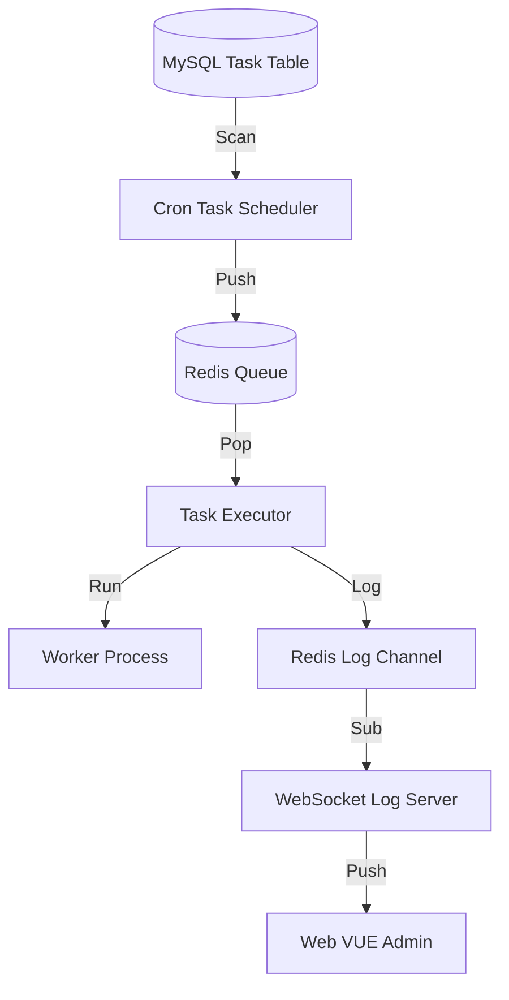

# Vatcron - 高性能 Webman 定时任务插件

<p align="center">
  <a href="https://github.com/walkor/webman">
    
  </a>
</p>

Vatcron 是一款专为 [Webman](https://www.workerman.net/doc/webman/) 框架设计的高性能、企业级定时任务管理插件。它利用 Workerman 的多进程和协程能力，实现了秒级精度的任务调度、实时可视化的日志监控以及高可靠的分布式锁机制，非常适合处理高并发、高频次的后台任务。

## 🚀 核心特性

- **⏱ 秒级精度调度**：支持标准的 Crontab 表达式（6位），精确到秒级执行任务。
- **⚡️ 高性能架构**：
  - **多进程隔离**：调度器（Scheduler）、执行器（Executor）、日志服务（LogServer）独立进程，互不干扰。
  - **协程/异步支持**：底层支持 Swoole 协程，轻松应对高并发 I/O 密集型任务。
- **📊 实时监控**：基于 WebSocket 的实时日志推送，任务执行情况尽在掌握。
- **🔒 分布式锁**：内置 Redis 分布式锁，确保多实例部署时任务不重复执行。
- **🛡 健壮稳定**：
  - **平滑重启/停止**：完善的信号处理机制，确保任务执行中不丢失数据。
  - **自动重试**：支持任务失败自动重试配置。
- **🔌 丰富的任务类型**：
  - **Command**：执行系统命令
  - **Class**：调用 PHP 类方法
  - **URL**：发送 HTTP 请求
  - **Shell**：执行 Shell 脚本

## 📋 环境要求

- PHP >= 8.1
- Webman >= 1.5
- Workerman >= 4.1 或 >= 5.0
- Redis 扩展 (必选)
- Swoole 扩展 (推荐，用于协程模式)

## 📦 安装

### 1. Composer 安装

```bash
composer require vat/vatcron
```

### 2. 导入数据库

创建必要的数据库表（`vat_cron` 和 `vat_cron_log`）：

```bash
mysql -u root -p your_database < vatcron.sql
```

## 🛠 配置说明

插件配置文件位于 `config/plugin/vatcron/app.php`。

```php
return [
    // 是否开启协程
    'enable_coroutine' => true,
    // 任务扫描间隔（秒）
    'scan_interval' => 5,
    // 定时任务表名
    'table_cron' => 'vat_cron',
    // 定时任务日志表名
    'table_log' => 'vat_cron_log',
    // 定时任务队列名称
    'cron_queue' => 'vatcron:cron_queue',
    // 定时任务日志队列名称
    'lock_prefix' => 'vatcron:lock:',
    // 定时任务日志订阅频道
    'log_subscribe' => 'vatcron:logs',
    // 是否将执行日志写入文件
    'log_write_file' => false,
];
```

## 💻 使用指南

### 1. 服务管理

Vatcron 提供了一套标准的命令行工具来管理服务：

```bash
# 启动服务 (调试模式)
php webman vatcron start

# 启动服务 (后台守护模式)
php webman vatcron start -d

# 停止服务
php webman vatcron stop

# 重启服务
php webman vatcron restart

# 查看服务状态
php webman vatcron status
```

### 2. 添加任务

#### 方式一：数据库直接添加

直接在 `vat_cron` 表中插入数据即可生效（无需重启服务）：

```sql
INSERT INTO `vat_cron` 
(`name`, `cron_expression`, `task_type`, `command`, `status`) 
VALUES 
('测试任务', '*/5 * * * * *', 1, 'echo "Hello Vatcron"', 0);
```

#### 方式二：代码添加

```php
use support\Db;

Db::table('vat_cron')->insert([
    'name' => '清理缓存',
    'cron_expression' => '0 0 2 * * *', // 每天凌晨2点
    'task_type' => 2, // 1:Command, 2:Class, 3:URL, 4:Shell
    'command' => 'App\\Task\\ClearCache::run',
    'status' => 0,
]);
```

### 3. 开发自定义任务

只需创建一个普通的 PHP 类，Vatcron 会自动调用指定的方法。

```php
namespace App\Task;

class MyTask
{
    public function execute($params = [])
    {
        echo "正在执行自定义任务...\n";
        // 业务逻辑
        return "执行成功";
    }
}
```

在任务配置中：
- Type: `2 (Class)`
- Command: `App\Task\MyTask::execute`

## 📡 实时日志监控

Vatcron 内置了 WebSocket 服务（默认端口 12348），前端可以连接该端口实时获取任务执行日志。

**WebSocket 地址**: `ws://127.0.0.1:12348`

**订阅协议**:
```json
{
    "type": "subscribe",
    "channel": "vatcron:logs"
}
```

**日志数据示例**:
```json
{
    "type": "log",
    "data": {
        "task_id": 1,
        "status": "success",
        "output": "Hello Vatcron",
        "duration": 0.05
    }
}
```

## 🧩 架构图解



## 📄 License

MIT

---

**Vatcron** - 让 Webman 定时任务管理变得简单而强大。
